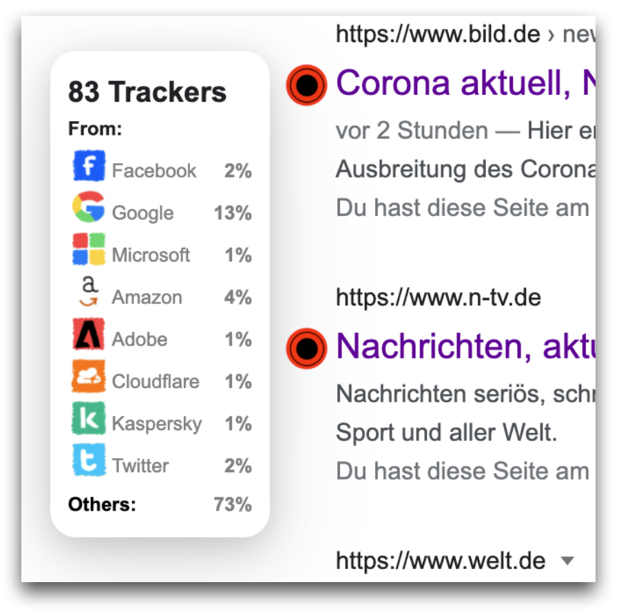
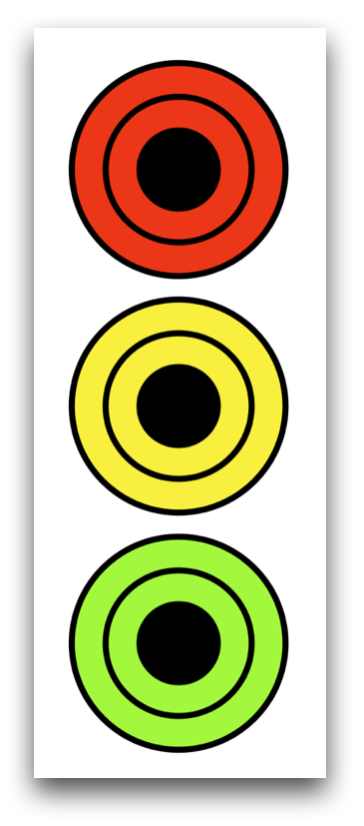

# CODE - one Plug-In for more Privacy
### Technical Report | DaWeSys | Summer'21

## About CODE
CODE is a browser extension for the Chrome-Browser. It allows users to get a quick overview about the information website track before they even open the website. With small labels next to the search results in Google they can easily decide whether to open a website or not.
Most people don't have the patience to read privacy policies. But privacy is important, and we shouldn't just trust that products are treating our data right. CODE uses a consistent rubric to grade privacy.

Most privacy policies are convoluted — sometimes even intentionally so. They can be difficult to read, and even more difficult to comprehend. Rarely do they provide actionable insight into protecting one's data.

Making matters worse, companies are often only held accountable for their privacy practices when a data breach occurs or when they experience fallout from mishandling user data (think Facebook's Cambridge Analytica scandal, for example).
If companies were held accountable for their privacy policies—not just for creating policies, but also for creating good ones—our data would be safer. Because privacy matters.

## Functionality
CODE makes privacy policies more convenient and accessible for those who simply don't have the time —or patience— to read full privacy policies themselves. Privacy should be more than just a box to check; they are fundamental to ensuring data transparency and allowing users to make informed choices.

Let's summarize the core functionality features of the extension.
Simply said the browser extension scans all results of a google search result and prints a label next to it. However, while that is totally true there is actually more functionalities implemented in the extension. 
In order to structure all functionalities you can divide program into five different parts: 
* The algorithm responsible for the label calculation
* The different labels
* Our Home page and most importantly the options page.
* The Privacy Support
* Our Backend as API 

### Our Backend as API
When implementing the Browser extension it was important to us to strictly divide the frontend part from the logical part meaning the actual calculation of the labels. Our goal was to build an independent backend that does not care where the request is coming from. This way we can also offer to use our backend as an API. A detailed documentation of our API can be found [here](https://app.swaggerhub.com/apis/WebProgramming/ApiDocumentation/1.0.0). 

### Extension 
The real quintessence of our extension is to display transparency in a way, that might make you raise your eyebrows.
You can customize the information you want displayed or the representation of our labels. Purely based to provide you with that piece of information that interests you the most, like which website is using a Facebook tracker for instance.  
We offer a free, open-source browser extension that displays the CODE rating of the sites of your google search. It works by periodically requesting the CODE database from our API, which means it never exposes your browsing activity to an external server, and then locally checking the pages you visit against that external database.

The extension is available for [Chrome](https://chrome.google.com/webstore/detail/cookie-decliner/pfgokjomcikflphieccllalibiejlcde/related?hl=de&authuser=0).

### Algorithm 

As an API and plugin that strives to promote transparency on the internet, it is only natural that it is our effort to be as transparent as possible ourselves. The way we calculate our labels is solely based on the information we are getting from our sources, standardizing them and simply taking the average score of said information. Luckily for us, most of our sources already return a score, which easily can be found on the respective website. Our only source of information, that needed some adjustment is the WhoTracksMe database.  With said database, we are taking into consideration what amount of tracker a certain website uses, lay some further emphasis on a few speficic ones of those trackers, certain categories those trackers a assigned to and so on. But we will get into more detail on that in later paragraphs.  We generally try to keep our on constributions as minimal as possible, to ensure, like said before, that we keep transparency as a high priority. 

### Expert Mode 

CODE was designed to simplify the transparency experience, so users can drive real results in terms of transparency and save time setting up privacy. 
The Expert Mode offers the full range of CODE features. It gives the user more control over their label calculation. We recommend it for advanced user with special preferences.
With the Expert Mode the user can influence the label calculation by giving higher weight to special criteria, for example:

WhoTracksMe | Other
------------ | -------------
Look For Facebook Tracker | Disable PrivacySpy
Look For Amazon Tracker | Disable Web Risk API
Weight Number Of Trackers | Disable PhishStats
Disable WhoTrackMe Database | 
Weight The Use Of HTTPS | 

If you desire more advanced features in CODE, here’s how you can switch to Expert Mode.

1.	Navigate to the Options page
2.	Click on the `Settings` button
3.	Switch `Enable Expert Mode` to ON 
4.	( If desired ) switch `Change Labels To Coins` to ON 

## Design
### Labels

CODE-Labels are designed to give users privacy information about websites real quick. With a **simple comprehensible design** users easily understand its meaning.

There are three labels: **green, yellow and red**. User will see the green one if the website is considered highly privacy sensitive and does not track their personal information. The yellow one appears, when there are some concerns about the website, which are not considered totally trustworthy. Lastly, there are red labels for websites, which are considered as not privacy sensitive or bare a risk for the user e.g. malicious software.

No matter which label appears, users always can **hover over the label** to see more information about it. Users will find the amount of trackers found on the page as well as some icons for the popular ones like the ones by Google or Facebook. This way users are more likely to understand how the label "got it color".

### Privacy Summary (Homepage / New Tab)

There are some design features on the Homepage which are worth mentioning. The Homepage appears on the New Tab in the browser and contains three main fields. The first and most present one is a number - privacy score. The privacy score summarizes the labels of the website visited by the user. It counts the green and golden labels among the visited websites and relates this number to labels from all visited labels. There are two more fields: an overview about recently calculated labels and a form to look up a label for a website. 
Since the Homepage summarizes the core functionality of the extension and informs users about it, it is simply called: **Privacy Summary**.

## Technical Details in a Nutshell
### Data sources
**WhotracksMe:** This database is part of an open-source project. It was created using the Cliqz browser and extension, and the chrome's Ghostery extension, whose main objective is to block and protect users from tracking. It includes more than 6,000 of the most popular websites and it includes detailed information the following elements: 
 * Categories
 * Companies 
 * Domains
 * Trackers
 * Sites

Similarly, it has statistics from each domain, for example: 
 * Average number of requests made to the tracker per page
 * Proportion of pages where a unique identifier (UID) was detected in the query string parameters sent with a request to this tracker.
 * Proportion of pages where the tracker only used HTTPS traffic
 * Average number of requests made to the tracker with tracking (cookie or query string) per page
  
On top of that, this database is being updated every month. Whic is a very important factor for us, because their information is the one we display in our pop up when hovering the CODE-label of a website.

 Website: https://www.whotracks.me  
 Based on: https://arxiv.org/abs/1804.08959 

### APIs

**Phishstats:** It is a real time Phishing database that gathers phishing URLs from several sources. It started in 2014, and it has now a Database with over 3 million records. Its free API is however very slow, and did not meet our requirements. Luckily enough, they also let us download from their webpage a csv file, that is being updated every 90 minutes, with phishing URLs from the past 30 days.
For each domain, it has the following information: 
* IP
* Score. 1 - 10. Being 10 the highest Phishing risk.
* URL
* Date
  
Website: https://phishstats.info/ 

**PrivacySpy:** To continue the line of open source projects devoted to privacy, we have now the PrivacySpy project. 
The creators are devoted to the "Privacy Matters"-Philosophy, and this is why they compiled a list of the most used websites worldwide. And they have assigned a score to each one of them. Score is again 0-10. This time is 10 the website with the best positive result.
In order to calculate the score, they use following criterias: 
* Data Handling, for example:
  * Does the policy allow personally-targeted or behavioral marketing? 
  * Does the service allow third-party access to private personal data?
* Transparency, for example: 
  * For example: Does the policy require users to be notified in case of a data breach? 
  * Is the policy's history made available? 
* Collection, for example:
  * Is it clear why the service collects the personal data that it does? 
  * Does the policy list the personal data it collects? 

Finally, they allow the public to download the data, which made it easier for us to integrate it to our server. Even though the database is not as big as previous data sources, it puts a great amount of work in calculating the scores. this is why we decided to include it in our label calculation. 

Website: https://privacyspy.org/ 

**Google Safe Browsing API:** Safe Browsing is a Google service that contains a lists of unsafe web resources, which Google also keeps up to date. Examples of unsafe web resources are social engineering sites (phishing and deceptive sites) and sites that host malware or unwanted software. Based on the fact, that Google is a very reliable source, we included it in our project.
 
Website: https://developers.google.com/safe-browsing 

**Terms Of Service Didn't Read:** This is also a project that started in 2011, which has the goal of "eliminating" the biggest lie of the Internet: "I have read the terms and conditions and I accept them". It has now a big community that are responsible of analyzing and interpreting the terms and conditions of the most used websites worldwide. 
The way it works is by granting each website a score, (A-E). A being the best one. And the score is based in a thorough anaylsis. It is an open community, and everyone can help submitting "cases" based on the terms and conditions or privacy policy of the website. At the end, just a few people can accept this cases and include them in the score. 
Example of cases are: 
  * Private messages can be read
  * Your browsing history can be viewed by the service
  * Third-party cookies are used for advertising
  * Your account can be deleted without prior notice and without a reason

Website: https://tosdr.org/ 

**TiltHub:** As stated in their description, Tilt-hub is a document storage for transparency information specified in the Transparency Information Language and is part of the Transparency Information Language and Toolkit. It provides a structured and machine-readable transparency information document about Websites. Even though it does not have (yet) a big database, the transparency documents that it provides makes it exceptionally easy to read the most important information from the privacy policy. 

Website: https://github.com/Transparency-Information-Language/tilt-hub 

## Label calculation
For each url we ask every datasource for information regarding this specific domain. Using these information we calculate a custom score from each datasource. In the next step we will simply calculate the average score of all datasource scores. This way we have a custom score for each domain. Of course, we do not include datasources that do not offer information on a domain. 
Following we will explain the method to calculate a score for each domain: 
### WhoTracksMe
The WhotracksMe database offers a great variety of data. We receive information about the trackers a domain uses, where the trackers are from, what kind of trackers they are, how the trackers communicate with their backend (https or http) and several other information. As we wanted to keep our label calculation as simple as possible we decided to only take the number of trackers into account. However, every user is able to enable more features in the options page and, therefore, can influence the label calculation theirself.
### PrivacySpy
 Privacyspy scores a label for some domains as well. Therefore, we simply request their label and map it to our label system. 
### Phishstats
Phishstats is similar to Privacyspy meaning that we also map their label to our label system. However, we decided that it should not be possible to reach our best label. This is because even existing in the Phishstats database is very suspicious.

### Google SafeBrowsing
The domains stored in the SafeBrowsing APi are domains that As the SafeBrowsing API by Google only stores unsafe domains. Those are for example phishing or social engineering sites. Therefore, we decided to keep our score calculation very simple: If there is any information provided for a domain, we give it the worst score, e.g. depending on the mode it is either 3 or 9. If, however, there is no information we return a score of 0 (meaning not found). 
This can seem rather unfair towards the domains as there is no way they can receive a good label in this function. However, not existing in this API is not something that should be rewarded as it is expected.

### Tosdr
Just as Privacyspy this databse offers a label that we can map to our  label system.

### Tilt

## Overview (TO DO)

### Chances & Concerns 
Finally we want to talk about possible chances and concerns. The quintessence of our effort and this API is to provide more tranparency and to give and insight into that, what is denied to the everyday user. We really hope, that through our doing, our Users get a better feel for what happens in the background while their surfing the web, a better understanding for who is watching and secretly gathering information. 
The chances that present themselves for our API are thanks to our backend structure quite extensive. To provide more information and to further protect from malicious websites, simply more sources need to be implemented. Aspects like for instance browser fingerprinting, especially when looking a new techlonogies like Googles FloC programm, are yet to be implemented, but provide an opportunity to further protect your personal data. Generally speaking does our API represent a starting point, to make transparency on the web more tangible. 
However is our API far from perfect. Concerns that followed were for instance the question of being relevant and up to date. Working with static databases rather than a dynamic cloud bases approach, we need to constantly look for updates and manually implement those if available. This demand for high maintenance certainly is our biggest concern, but generally speaking, our approach with static assets is to be tackled in future development.

